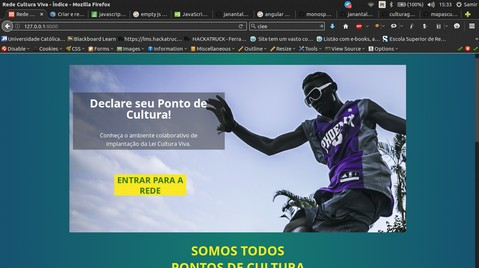

# mapasculturais-culturaviva
### Configurar tema culturaviva

Para configurar o tema culturaviva no mapasculturais devemos alterar o arquivo `config.php` para assim setar o tema Cultura Viva no Mapas

 *(Para fazer essa alteração é possível o uso de qualquer IDE)*
```
   vim mapasculturais/src/protected/application/conf/config.php
```
*(use `:h` dentro do vim para ver as opções de comando)*

Deve ficar desta forma:


Entre na pasta `/mapasculturais` e reinicie o Vagrant
```
cd mapasculturais

vagrant reload
```
Acesse a maquina virtual:

  ` vagrant ssh `

E acesse a pasta script e para compilar o tema:
```
/vagrant/scripts
./compile-sass.sh
```
### **Pronto!**
Agora, em seu navegador, acesse o Cultura Viva usando este endereço:

` 127.0.0.1:8000 `

*(Se aparecer essa tela abaixo está tudo certo)*



A próxima tela será a de autenticação

**→ A parte de cima é para super usuários, precisa só clicar em ok.**

→ A parte de baixo é para criar usuários normais.

**Se ocorrer algum erro na instalação fale conosco.**
